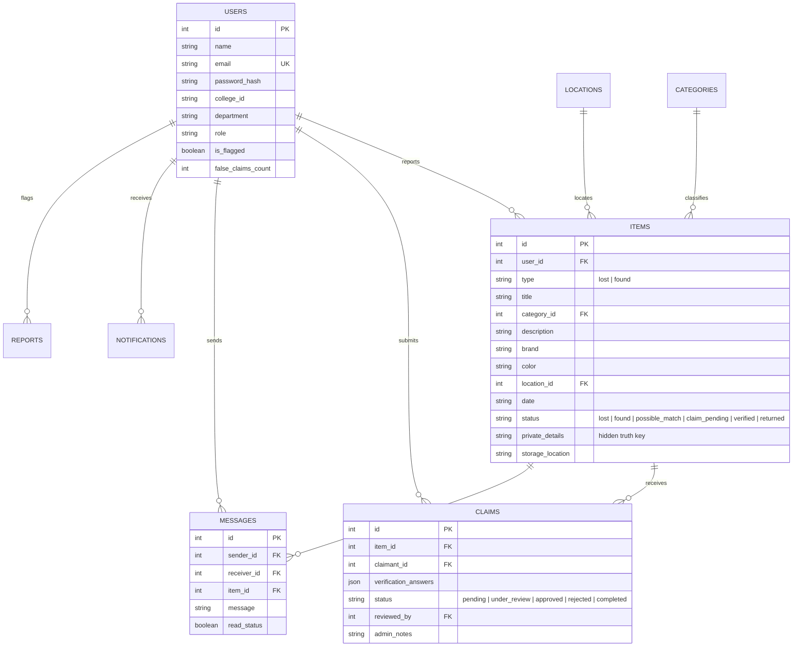

# 🎓 CampusFind — College Lost & Found

> **«Lost something? Find it on Campus.»**  
> *A full-stack, production-ready collegiate lost & found web application designed to connect students, faculty, and campus security for verified item recovery.*

---

## 📌 Executive Summary

On university campuses, personal items like student IDs, calculators, earbuds, laptops, keys, and backpacks are frequently misplaced. Traditionally, recovery relied on unorganized WhatsApp groups, physical notice boards, or overcrowded security desks, leading to lost posts, fake claims, privacy leaks, and poor coordination.

**CampusFind** solves this with a centralized, secure digital platform featuring:
- **College-Domain Authentication** (configurable `@college.edu` domain restriction).
- **Intelligent Algorithmic Matching** (calculates real-time similarity scores based on category, keywords, color, brand, campus location, and date proximity).
- **Confidential Ownership Verification** (protects secret identifying traits from public view so finders/staff can verify true ownership before approval).
- **Safe In-App Messaging** (coordinates safe handovers without exposing student phone numbers or personal emails).
- **Interactive Campus Map** (visual map with pins for campus quads, labs, libraries, and food courts).
- **Anti-Fraud & Moderation System** (automatically detects repeat false claimants, flags accounts after 3 strikes, and alerts administrators).
- **1-Click Demo Persona Bar** (instant switching between Students, Staff, and Campus Administrators for testing).

---

## 🚀 Live Demo & Quick Start

- **🌐 Live Production URL:** [https://campusfind-ten.vercel.app](https://campusfind-ten.vercel.app)
- **📂 GitHub Repository:** [https://github.com/Tony671378/CampusFind](https://github.com/Tony671378/CampusFind)

### Prerequisites
- **Node.js** v18+ (tested on Node v20 & v24)
- **npm** v9+

### 1. Installation
Clone the repository and install dependencies:
```bash
git clone https://github.com/Tony671378/CampusFind.git
cd CampusFind
npm run dev
```

### 2. Run the Development Server
```bash
npm run dev
```
Open **[http://localhost:3000](http://localhost:3000)** in your browser.

> **Tip:** You can also run commands directly from the root folder:
> ```bash
> npm run dev
> npm run build
> ```

---

## 👥 Seeded Demo Accounts (Pre-configured)

CampusFind comes pre-seeded with **10 realistic accounts**, **15 lost items**, **15 found items**, sample claims, messages, and campus locations.

The application includes a **Demo Persona Switcher Bar** at the very top of every page for instant 1-click role switching:

| Name | Role | Email | Password | Details |
|---|---|---|---|---|
| **Alex Rivera** | `student` | `alex.rivera@college.edu` | `college123` | CS 3rd Year (Reported Lost JBL Earbuds) |
| **Emily Watson** | `student` | `emily.watson@college.edu` | `college123` | InfoSci 1st Year (Lost Fossil Leather Wallet) |
| **Priya Sharma** | `student` | `priya.sharma@college.edu` | `college123` | ECE 2nd Year (Lost Casio fx-991EX Calculator) |
| **Marcus Chen** | `student` | `marcus.chen@college.edu` | `college123` | Mech 4th Year (Lost Blue Hydro Flask) |
| **Rohan Patel** | `student` | `rohan.patel@college.edu` | `college123` | EE 3rd Year (Found Casio Calculator in Lab) |
| **Officer James Hall** | `staff` | `security.hall@college.edu` | `college123` | Campus Security Post (Holds Found Items in Custody) |
| **Dr. Linda Vance** | `staff` | `linda.vance@college.edu` | `college123` | Central Library Staff (Circulation Valuables Safe) |
| **Dean Arthur Miller** | `admin` | `admin.miller@college.edu` | `college123` | Campus Administrator (Full Moderation Controls) |

---

## 🛠️ Technology Stack

| Layer | Technologies Used | Rationale |
|---|---|---|
| **Frontend** | [Next.js](https://nextjs.org) 16 (App Router), React 19, TypeScript | Server components, high performance, fast hydration |
| **Styling** | Tailwind CSS v4, Vanilla CSS Design System | Plus Jakarta Sans & Outfit fonts, glassmorphism, responsive collegiate design |
| **Icons** | `lucide-react` | Clean, modern iconography |
| **Backend** | Next.js App Router API Routes (`/api/...`) | Type-safe, modular REST endpoints |
| **Database** | SQLite via `better-sqlite3` (WAL Mode enabled) | Zero-dependency, relational schema, zero external barrier, instantaneous queries |
| **Auth & Security** | `bcryptjs` (password hashing), `jsonwebtoken`, HttpOnly Cookies | Role-based authorization (`student`, `staff`, `admin`) |
| **Media Storage** | Local Multipart Storage (`/public/uploads/`) | Reliable local file persistence without third-party API dependencies |
| **AI / Algorithmic** | Multi-factor weighted string & token matching + NLP Parser | Category (30%), Keywords (35%), Location (15%), Color (10%), Brand (10%), Date (10%) |

---

## 🏛️ System Architecture & Data Model



---

## 🔄 End-to-End User Flow (Success Criteria Verified)

```
[Student Reports Lost Item] 
           │
           ▼
[Smart Matching Engine compares with Found Items] 
           │
           ▼
[Possible Match Alert Generated (e.g. 98% Match)]
           │
           ▼
[Student Submits Confidential Ownership Claim]
   • Answers questions: interior contents, serial digits, marks
           │
           ▼
[Finder / Campus Security Inspects Answers Side-by-Side]
   • Compares claimant answers with hidden verification traits
           │
           ▼
[Claim Approved & Safe Handover Initiated]
   • Handover assigned to Security Gatehouse or Library Desk
           │
           ▼
[Safe In-App Messaging between Student & Staff]
           │
           ▼
[Item Handed Over & Marked Returned]
   • Confetti celebration, dynamic recovery rate increases!
```

---

## 📡 API Endpoints Reference

### Authentication
- `POST /api/auth/register` — Register student/staff with college domain validation.
- `POST /api/auth/login` — Authenticate credentials & issue HttpOnly JWT token.
- `GET /api/auth/me` — Retrieve active user session.
- `POST /api/auth/logout` — Invalidate session cookie.
- `POST /api/auth/quick-login` — 1-click test role switcher.

### Items & Matching
- `GET /api/items` — Query catalog with filters (`type`, `category_id`, `location_id`, `search`, `color`, `brand`, `status`).
- `POST /api/items` — Report lost or found item (runs matching & alerts owners).
- `GET /api/items/:id` — Item details (protects `private_details` from public viewers).
- `PUT /api/items/:id/status` — Update item status (`returned`, `closed`, etc.).
- `GET /api/matches` — Compute multi-factor smart matching similarity scores.

### Claims & Verification
- `GET /api/claims` — List submitted and incoming claims.
- `POST /api/claims` — Submit verification claim (checks fraud strikes).
- `PUT /api/claims/:id` — Review claim (`under_review`, `approved`, `rejected`, `completed`).

### Communication & Administration
- `GET /api/messages` — Fetch conversation threads and messages.
- `POST /api/messages` — Send in-app message.
- `GET /api/notifications` — Fetch user alerts & unread count.
- `GET /api/admin/stats` — Dynamic analytics, category distribution, recovery rate.
- `GET /api/admin/users` — User audit & anti-fraud strike clearance.
- `POST /api/admin/seed` — 1-click database reset and demo data re-seeding.
- `POST /api/upload` — File upload with 5MB validation.
- `POST /api/ai-assist` — Description enhancement & NLP search query parsing.

---

## 🧪 Testing Instructions

Run the automated integration test script to verify all 11 lifecycle criteria:
```bash
node -e "
async function test() {
  const res = await fetch('http://localhost:3000/api/admin/stats');
  const d = await res.json();
  console.log('CampusFind System Stats:', d.stats);
}
test();
"
```

---

## 🔒 Security & Anti-Fraud Features
- **Password Hashing:** 10-round salted BCrypt.
- **Privacy Shield:** Finder's private verification details and student contact numbers are strictly filtered on the server and never exposed in public JSON responses.
- **Anti-Fraud Strike System:** If a claimant submits repeated false claims, each rejection adds a strike. Upon 3 strikes, the account is automatically restricted from submitting further claims and flagged for Dean review.
- **File Upload Safeguards:** 5MB limit, sanitized filenames.

---

## 📄 License
MIT License. Built for university campus communities.
